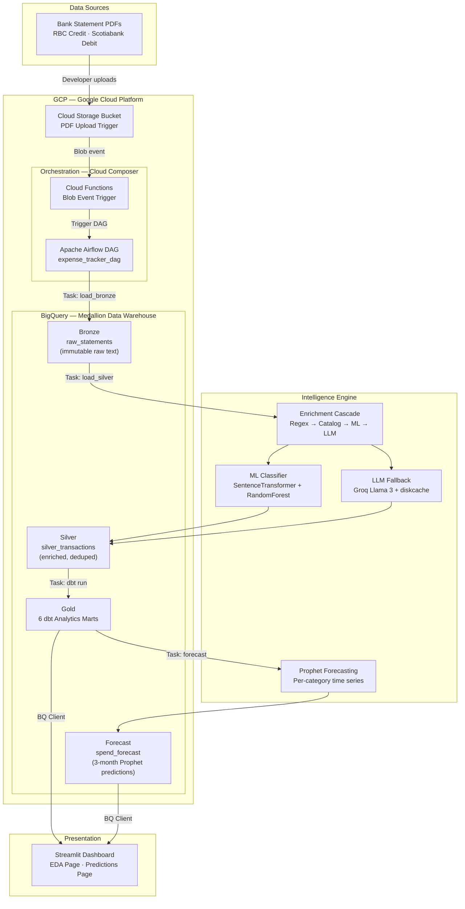

# 💳 Expense Intelligence Pipeline

    

A production-grade, multi-tenant personal finance intelligence pipeline that transforms raw bank statement PDFs into actionable financial insights. Built with **Python**, **dbt**, **Google BigQuery**, **Prophet** forecasting, and **LLMs** (Groq).

**What it does:**
- 📄 Parses bank statement PDFs (RBC, Scotiabank) using `pdfplumber`
- 🏷️ Enriches transactions with category/subcategory via hybrid ML cascade (Regex → Fuzzy Catalog → SentenceTransformer embeddings → LLM fallback)
- 📊 Builds analytics marts with dbt (6 Gold tables: spending trends, anomalies, recurring expenses, merchant insights, and fixed vs variable splits)
- 🔮 Forecasts 3-month category spend using Facebook Prophet
- 🎨 Visualizes insights in an interactive Streamlit dashboard (EDA + Predictions pages)

---

## 🏗️ System Architecture



**Current Status:** Stages 1–5 are implemented and run manually. Airflow orchestration is in the roadmap.  
**See:** [Architecture Deep Dive](docs/architecture.md) for full details on Medallion pattern, GCP services, and design decisions.

---

## 📊 Pipeline Overview

| Layer | Table(s) | Purpose | Technology |
|-------|----------|---------|-----------|
| **Bronze** | `raw_statements` | Immutable audit trail of raw PDF text | pdfplumber |
| **Silver** | `silver_transactions` | Cleaned, deduplicated, enriched transactions | Python pandas + enrichment cascade |
| **Gold** | 6 marts (see below) | Analytics-optimized aggregates and insights | dbt-bigquery SQL |
| **Forecast** | `spend_forecast` | 3-month forward predictions per category | Facebook Prophet |
| **Dashboard** | Interactive UI | EDA + Predictions pages | Streamlit + Plotly |

### Gold Analytics Marts

| Mart | Key Metrics | Query Example |
|------|-------------|---|
| `monthly_category_spend` | Monthly spend aggregates per category | "How much did I spend on groceries this month?" |
| `spending_trends` | Month-over-month change analysis | "Is my dining out spending increasing?" |
| `spending_anomalies` | Z-score based flagging | "Which transactions were unusual?" |
| `recurring_expenses` | Subscription + habit detection | "What subscriptions do I have?" |
| `merchant_insights` | Top merchants by spend & wallet share | "Where do I spend the most money?" |
| `fixed_vs_variable_spend` | Budget split: Essential vs Discretionary | "How much is fixed vs variable?" |

---

## 🚀 Quick Start

### Prerequisites

- **Python 3.10+**
- **Google Cloud Project** with BigQuery enabled
- **GCP Service Account** with BigQuery permissions (JSON key file)
- **Groq API Key** (free tier for Llama 3; sign up at [groq.com](https://groq.com))
- **Bank statement PDFs** in `data/raw/` (RBC or Scotiabank e-statements)

### Installation

```bash
# Clone the repo
git clone <your-repo-url>
cd Expense_Tracker

# Create and activate virtual environment
python -m venv venv
source venv/bin/activate  # On Windows: venv\Scripts\activate

# Install dependencies
pip install -r requirements.txt
pip install -e .
```

### Configuration

Create a `.env` file in the root directory:

```env
GOOGLE_APPLICATION_CREDENTIALS="/path/to/your/gcp-service-account.json"
GROQ_API_KEY="your-groq-api-key"
```

### Running the Pipeline (Manual)

```bash
# Stage 1: Load raw PDFs into BigQuery Bronze table
python src/pipeline/load_bronze_sim.py \
  data/raw/RBC_Statement_Jan2024.pdf \
  Kanwar \
  Credit

# Stage 2: Parse, enrich, deduplicate, and load Silver
python src/pipeline/load_silver.py

# Stage 3: Run dbt to generate Gold analytics marts
cd expense_tracker_dbt
dbt run
cd ..

# Stage 4: Generate 3-month spend forecasts
python src/analytics/forecast_monthly_spend.py

# Stage 5: Launch Streamlit dashboard
streamlit run src/dashboard/app.py
```

Dashboard opens at `http://localhost:8501`. Navigate to **Historical Observations** (EDA) or **Predictive Spend** (Forecasts).

---

## 📚 Documentation

| Document | Purpose |
|----------|---------|
| [Architecture Deep Dive](docs/architecture.md) | Medallion pattern, GCP services, design decisions, orchestration roadmap |
| [Data Pipeline & ETL](docs/data_pipeline.md) | Bronze → Silver → Gold detailed walkthrough, dbt models, optimization tips |
| [ML & Forecasting](docs/ml_forecasting.md) | Transaction categorization (4-stage cascade), Prophet time-series forecasting |
| [Analytics & Insights](docs/analytics_results.md) | Gold mart descriptions, KPIs, dashboard pages, interpretation guides |

---

## 📂 Project Structure

```
Expense_Tracker/
├── README.md                          # This file
├── docs/                              # Detailed documentation
│   ├── architecture.md
│   ├── data_pipeline.md
│   ├── ml_forecasting.md
│   └── analytics_results.md
├── src/
│   ├── 1_train_model.py              # ML model training
│   ├── parse_statement.py            # PDF parsing orchestrator
│   ├── enrich.py                     # 4-stage enrichment cascade
│   ├── llm_client.py                 # LLM API client (Groq, OpenAI, Gemini)
│   ├── pipeline/
│   │   ├── load_bronze_sim.py        # Single PDF → Bronze
│   │   ├── load_bronze_batch.py      # All PDFs → Bronze
│   │   └── load_silver.py            # Bronze → Silver
│   ├── parsing/
│   │   ├── extract_pdf.py            # pdfplumber text extraction
│   │   ├── clean_transactions.py     # Line sanitization
│   │   └── bank_detector.py          # Bank format detection
│   ├── analytics/
│   │   └── forecast_monthly_spend.py # Prophet forecasting
│   └── dashboard/
│       └── app.py                    # Streamlit dashboard
├── expense_tracker_dbt/              # dbt project (Gold layer)
│   ├── dbt_project.yml
│   ├── models/
│   │   ├── staging/
│   │   │   └── stg_transactions.sql
│   │   └── marts/                    # 6 Gold analytics tables
│   │       ├── monthly_category_spend.sql
│   │       ├── spending_trends.sql
│   │       ├── spending_anomalies.sql
│   │       ├── recurring_expenses.sql
│   │       ├── merchant_insights.sql
│   │       └── fixed_vs_variable_spend.sql
│   └── README.md
├── config/
│   └── bank_profiles/               # Bank-specific parsing rules
│       ├── rbc.json
│       └── scotia.json
├── data/
│   ├── raw/                         # Input PDFs
│   ├── merchant_catalog.json        # Merchant → category mapping
│   ├── trainings/                   # Labeled training data for ML
│   └── .llm_cache/                  # LLM response SQLite cache
├── models/                          # Trained ML artifacts
│   ├── category_classifier.pkl
│   ├── subcategory_classifier.pkl
│   ├── category_encoder.pkl
│   └── subcategory_encoder.pkl
├── requirements.txt
├── .env                             # Secrets (DO NOT COMMIT)
└── .gitignore
```

---

## 🔬 Key Technologies

| Component | Technology | Purpose |
|-----------|-----------|---------|
| PDF Parsing | `pdfplumber` | Extract text from bank statement PDFs |
| Data Wrangling | `pandas` | DataFrames throughout the pipeline |
| Text Matching | `rapidfuzz` | Fuzzy matching merchant names against catalog |
| Embeddings | `sentence-transformers` | 384-dim semantic embeddings for merchant text |
| ML Classification | `scikit-learn` | RandomForest for category/subcategory prediction |
| LLM Fallback | `groq-python` (Llama 3), with OpenAI/Gemini options | Merchant standardization for novel entries |
| LLM Cache | `diskcache` | SQLite-backed cache to avoid re-API calls |
| Data Warehouse | `google-cloud-bigquery` | Medallion architecture (Bronze/Silver/Gold) |
| Transformation | `dbt-bigquery` | SQL modeling with lineage, testing, documentation |
| Forecasting | `prophet` | Time-series forecasting with seasonality & holidays |
| Visualization | `streamlit` + `plotly` | Interactive dashboard with multi-page support |

---

## 🎨 Dashboard Features

### Page 1: Historical Observations (EDA)
- **KPI Cards**: Latest month spend, average transaction size, anomaly count
- **Stacked Bar Chart**: Fixed vs Variable spend over 12 months
- **Donut Chart**: Wallet share by category
- **Anomalies Table**: Top 20 high Z-score transactions
- **Recurring Expenses Table**: Detected subscriptions with annual projections

### Page 2: Predictive Spend Engine
- **Metric Cards**: 3-month projected spend and confidence intervals
- **Forecast Slider**: Select 1–3 month prediction horizon
- **Category Charts**: Historical trend + Prophet forecast with confidence bands
- **Forecast Table**: Per-category projections
- **Wallet Outlook**: Aggregate spending trajectory

**Multi-tenant Support:** Sidebar filters by user and bank statement source.

---

## 🧠 Machine Learning

### Transaction Categorization (4-Stage Cascade)

1. **Regex Heuristics** (~30% coverage): Hard-coded patterns for Canadian merchants (Tim Hortons, Rogers, Netflix, etc.)
2. **Fuzzy Catalog Lookup** (~50% cumulative): Merchant master list with 70%+ similarity threshold
3. **ML Classifier** (~15% cumulative): SentenceTransformer embeddings (384-dim) + RandomForest
4. **LLM Fallback** (~5% cumulative): Groq Llama 3 for novel merchants (with SQLite result caching)

**Total Coverage:** ~100% of transactions categorized.

### Spend Forecasting (Prophet)

- **Model**: Facebook Prophet additive decomposition
- **Input**: Monthly category spend from `monthly_category_spend` Gold mart
- **Data Densification**: Missing months filled with $0 to handle sparse categories
- **Seasonality**: Yearly seasonality enabled; Canadian holidays included
- **Cross-Validation**: Runs at 18+ months of history (MAPE, RMSE, MAE metrics)
- **Output**: 3-month forward predictions with 80% confidence intervals

See [ML & Forecasting](docs/ml_forecasting.md) for full technical details.

---

## 🔐 Security & Privacy

- **Service Account:** GCP credentials stored in `Keys/` (`.gitignore` protected, **never commit**)
- **Tenant Isolation:** All data partitioned by `user_name` in BigQuery
- **Multi-Tenant Design:** Separate users (e.g., Kanwar, Partner, Family) can share the same GCP project without data leakage
- **LLM Cache:** Results cached locally to avoid unnecessary API calls
- **.env File:** Secrets file is `.gitignore` protected; never commit credentials

---

## 📈 Roadmap

### Planned Enhancements

1. **Cloud Storage Integration** → Upload PDFs to GCS bucket instead of local filesystem
2. **Cloud Composer (Airflow)** → Automated orchestration; auto-trigger on PDF upload via Cloud Functions
3. **Incremental Models** → dbt incremental materializations to avoid full refreshes
4. **Data Quality Tests** → dbt tests + Great Expectations for schema and value validation
5. **Monitoring & Alerting** → Cloud Logging dashboards and email notifications for pipeline failures
6. **Budget Targets** → User-defined per-category budgets; actual vs forecast comparisons
7. **Peer Benchmarking** → Anonymous spending cohort comparisons (with privacy controls)
8. **Ensemble Forecasting** → Combine Prophet with ARIMA, Exponential Smoothing, and ML-based forecasts

---

## 🛠️ Development

### Running Tests

```bash
# dbt tests (data quality)
cd expense_tracker_dbt
dbt test

# Generate dbt documentation
dbt docs generate
dbt docs serve  # Opens http://localhost:8000
```

### ML Model Training (Retraining)

```bash
# After adding new labeled data to data/trainings/FinalTransaction.csv
python src/1_train_model.py
```

### Local dbt Development

```bash
cd expense_tracker_dbt

# Debug connection
dbt debug

# Run specific model
dbt run --select monthly_category_spend

# Full refresh (ignore incremental logic)
dbt run --full-refresh
```

---

## 📝 License

Private project. See LICENSE file for details.

---

## 👤 Author

**Kanwar Raj Singh Sandhu**  
Analytics Engineer | Data Engineering  
[GitHub](https://github.com/kanwarrajsinghsandhu) | [Email](mailto:kanwarrajsinghsandhu@gmail.com)

---

## 📞 Support

For issues, feature requests, or questions:
1. Check the [docs/](docs/) folder for detailed guidance
2. Open a GitHub Issue with reproduction steps
3. Contact the author

---

**Last Updated:** June 2024 | **Status:** Production-ready (manual execution)
