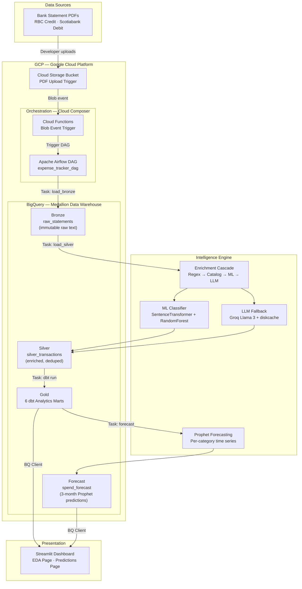

# Architecture Overview — Expense Intelligence Pipeline

## System Architecture Diagram



---

## Medallion Data Architecture

The project follows the **Medallion architecture pattern**, a widely-adopted data engineering best practice that separates concerns across three layers:

### Layer 1: Bronze (Raw Data)

**Table:** `raw_statements`  
**Purpose:** Immutable audit trail of raw data ingestion  
**Content:** PDF pages extracted from bank statements, stored as JSON text blobs  
**Key Columns:**
- `ingestion_ts` — UTC timestamp when PDF was processed
- `file_name` — original PDF filename
- `raw_text_content` — complete page text extracted via pdfplumber
- `metadata` — JSON object: `detected_bank`, `page_count`, `owner_name`, `statement_type`
- `file_hash` — SHA-256 hash for integrity verification

**Mutability:** Immutable. No updates or deletes — only appends.  
**Retention:** Permanent. This is the ground truth.

### Layer 2: Silver (Cleaned & Enriched)

**Table:** `silver_transactions`  
**Purpose:** Standardized, deduplicated transaction records ready for analysis  
**Content:** One row per unique transaction with enriched metadata  
**Key Columns:**
- `user_name` — tenant identifier (multi-tenant isolation via partition key)
- `bank_name`, `statement_type` — source metadata
- `date`, `description`, `amount` — core transaction fields
- `category`, `subcategory` — enriched via 4-stage cascade (regex → catalog → ML → LLM)
- `merchant_standardized` — canonical merchant name
- `match_type` — how category was determined (REGEX_RULE, CATALOG, ML_CLASSIFIER, LLM_FALLBACK)
- `dedup_key` — SHA-256 hash of (date, merchant, amount, user) for duplicate detection
- ML features: `posting_lag_days`, `transaction_cycle_day`, `transaction_weekday`, `is_weekend`, `is_foreign_currency`

**Deduplication:** Before each Silver load, newly parsed transactions are checked against existing `dedup_key` values in BigQuery. Duplicates are dropped.  
**Mutability:** Append-only. Historical records are never updated.

### Layer 3: Gold (Analytics Marts)

**Built with:** dbt-bigquery  
**Purpose:** Purpose-built analytical tables optimized for dashboard queries  
**Materialization:** All marts are `table` (BigQuery native tables for performance)

#### Gold Mart Models

| Mart | Key Metrics | Use Case |
|------|-------------|----------|
| `monthly_category_spend` | SUM(amount), COUNT(*), AVG(amount) per user/bank/month/category | Trend analysis, wallet share, forecasting input |
| `spending_trends` | MoM change in spend per category (via LAG) | Month-over-month growth/decline detection |
| `spending_anomalies` | Transactions flagged as Normal / Moderate / High Anomaly | Exception reporting in dashboard |
| `recurring_expenses` | Subscriptions, weekly habits, quarterly charges with projected annual cost | Recurring commitment tracking |
| `merchant_insights` | Total spend, visit count, % of wallet per merchant | Merchant-level spending patterns |
| `fixed_vs_variable_spend` | Spend split: Fixed/Essential vs Variable/Discretionary | Budget planning and lifestyle analysis |

---

## GCP Services: Status & Role

| Service | Role in Pipeline | Status | Notes |
|---------|------------------|--------|-------|
| **Google Cloud Storage (GCS)** | PDF upload entry point; triggers orchestration | **Roadmap** | Not yet implemented; currently PDFs staged locally in `data/raw/` |
| **Cloud Functions** | Serverless trigger for blob events | **Roadmap** | Not yet implemented; will auto-invoke Airflow DAG on PDF upload |
| **Cloud Composer (Airflow)** | Orchestration engine for multi-task DAGs | **Roadmap** | Not yet implemented; will replace manual CLI invocations |
| **BigQuery** | Primary data warehouse (Bronze/Silver/Gold/Forecast layers) | **Implemented** | Full production use; 4-layer Medallion in `credit_card_analytics` dataset |
| **BigQuery Storage API** | High-throughput data reads from Streamlit | **Implemented** | Disabled in Streamlit (IAM restricted); Streamlit uses standard BigQuery client |

---

## Tenant Isolation & Multi-Tenancy

All data is partitioned by `user_name`, enabling strict tenant isolation:

- **Bronze:** No `user_name` column; partitioning implicit in filename metadata
- **Silver:** Partitioned by `user_name`; BigQuery partition key ensures query filters are efficient
- **Gold:** All marts inherit `user_name` partitioning from staging view
- **Dashboard:** Sidebar filter on `user_name`; queries automatically scoped to selected tenant

This allows multiple users (e.g., `Kanwar`, `Partner`, `Family Member`) to share the same GCP project without data leakage.

---

## Data Lineage & Observability

**dbt Lineage:** Run `dbt run` and inspect `target/catalog.json` and `target/manifest.json` for a complete DAG of table dependencies.

**Key Dependencies:**
```
raw_statements (Bronze)
    ↓
silver_transactions (Silver, via parse + enrich pipeline)
    ↓
stg_transactions (dbt staging view)
    ↓
├── monthly_category_spend
├── spending_trends
├── spending_anomalies
├── recurring_expenses
├── merchant_insights
└── fixed_vs_variable_spend (Gold marts)
    ↓
[Prophet Forecasting]
    ↓
spend_forecast (Forecast table)
    ↓
Streamlit Dashboard
```

---

## Key Design Decisions

### 1. Medallion Pattern vs. ELT vs. Traditional ETL

**Decision:** Medallion (Bronze → Silver → Gold).

**Why:** Separates concerns. Bronze is a legal archive of raw data; Silver is the single source of truth for transactions; Gold is optimized for analytics queries. Enables versioning and recovery.

### 2. SHA-256 Deduplication (not database-level uniqueness)

**Decision:** `dedup_key = SHA256(date | merchant | amount | user)` checked before Silver insert; duplicates dropped.

**Why:** Bank statements often have duplicate transactions across month boundaries (statement overlap). A natural composite key would break on legitimate duplicate transactions from the same merchant on the same day. SHA-256 hash checks against previously seen combinations without enforcing DB constraints.

### 3. dbt for Gold Layer (not manual SQL views)

**Decision:** Use dbt models (with SQL templating) for all Gold marts.

**Why:** Enables testing, documentation, lineage tracking, and version control. Gold layer logic is code, not hidden in production queries.

### 4. Four-Stage Enrichment Cascade (Regex → Catalog → ML → LLM)

**Decision:** Merchants are categorized in order: hard-coded regex → fuzzy catalog lookup → ML embeddings + RandomForest → Groq LLM fallback.

**Why:** Cost-effective (free heuristics first) and high-coverage (most merchants match early stages). LLM is only invoked ~5% of the time for truly novel merchants. LLM results are cached in SQLite to avoid re-API-calling.

### 5. Prophet Forecasting (not ARIMA / Exponential Smoothing)

**Decision:** Facebook Prophet with yearly seasonality, Canadian holidays, and changepoint detection.

**Why:** Handles missing data gracefully (months with $0 spend are treated as true zeros); allows flexible trend changes; includes holiday effects for Canadian spending patterns.

---

## Running the Pipeline

### Current State (Manual)

All stages are run manually via CLI or Python notebooks:

```bash
# Stage 1: Ingest a single PDF into Bronze
python src/pipeline/load_bronze_sim.py data/raw/RBC_Statement_Jan2024.pdf Kanwar Credit

# Stage 2: Parse, enrich, deduplicate, and load into Silver
python src/pipeline/load_silver.py

# Stage 3: Run dbt to generate Gold marts
cd expense_tracker_dbt && dbt run

# Stage 4: Generate 3-month forecasts
python src/analytics/forecast_monthly_spend.py

# Stage 5: Launch Streamlit dashboard
streamlit run src/dashboard/app.py
```

### Target State (Automated — Roadmap)

```
PDF Upload to GCS
    ↓
Cloud Functions triggered
    ↓
Airflow DAG spawned
    ↓
[Tasks: load_bronze → load_silver → dbt run → forecast]
    ↓
Streamlit reads from BigQuery
```

---

## Next Steps & Roadmap

1. **Implement Cloud Storage trigger** — upload PDFs to GCS bucket instead of local `data/raw/`
2. **Deploy Cloud Functions** — serverless event handler for `storage.objects.finalize` events
3. **Migrate to Cloud Composer (Airflow)** — orchestrate the multi-stage pipeline
4. **Add data quality tests** — dbt tests and Great Expectations for schema/value validation
5. **Implement incremental dbt models** — avoid full refresh of Gold marts on every run
6. **Add monitoring & alerting** — Cloud Logging, Data Studio dashboards for pipeline health
